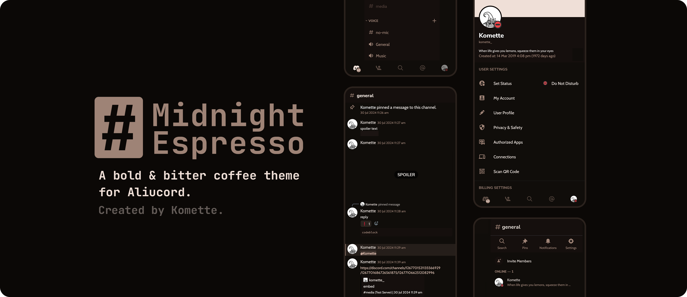

## Requirements
- Aliucord & Themer Installed (duh)
  - Transparency set to None
  - Enable Custom Fonts
- Dark Mode Enabled
- (Optional) Set Chat Font Scalling to 80% or any other size that fits your preferences

## What's new?
### Midnight-Espresso (formerly Koffi) v2.0.0
- Complete theme overhaul
- New font replacement & switched font host to Github
- Fixed uncolored texts and icons
- Removed some unnecessary strings (ringtone, overlay_alpha)
##### You can check the full changelog [here](https://github.com/kartoflu/koffi/blob/main/CHANGELOG.md)

## Manual Installation
Currently legacy is not available for regular installation. For the time being, please refer to this guide instead until the links are fixed.
<!-- Having troubles with regular installation? You can refer to this guide instead! (Don't worry, it's not even that complicated) -->
- Download theme file from [Releases](https://github.com/kartoflu/koffi/releases/tag/v1.0.0)
- Move the file you just downloaded to Aliucord/themes
- Restart the app

## Visual Tweak/Plugin Config
You saw the previews, you know what's coming. To get the visual tweak as featured in title preview, the appropriate settings of these folowing plugins is necessary:
### BetterChatbox
#### General
- Use old gallery button: Disabled
- Use small gallery button: Enabled
- Always show send button: Disabled
- Avatar display mode: None
- Leave the rest as default

#### Radii
- Chat box radius: Set as 57
- Button radius: Set as 57
- Leave the rest as default

#### Sizing
- Avatar size: Leave as default
- Chatbox height: Set as 114
- Button sizing: Set as 114

### NoBurnIn: Enable these folowing
- Unread counter
- Drawer button
- Search button
- Thread button
- Member button
- Call button
- Video button

### Bonus
- CustomTimestamp: Set the custom timestamp format as `k:mm:ss | EEEE, MMM d yyyy` <!-- k:m:s (heh) -->
- SquareAvatars: Simply install the plugin. That's it.

## Previews

<!-- poop theme is no more!!1!xddzs -->

###### note to self: update repo name & links
